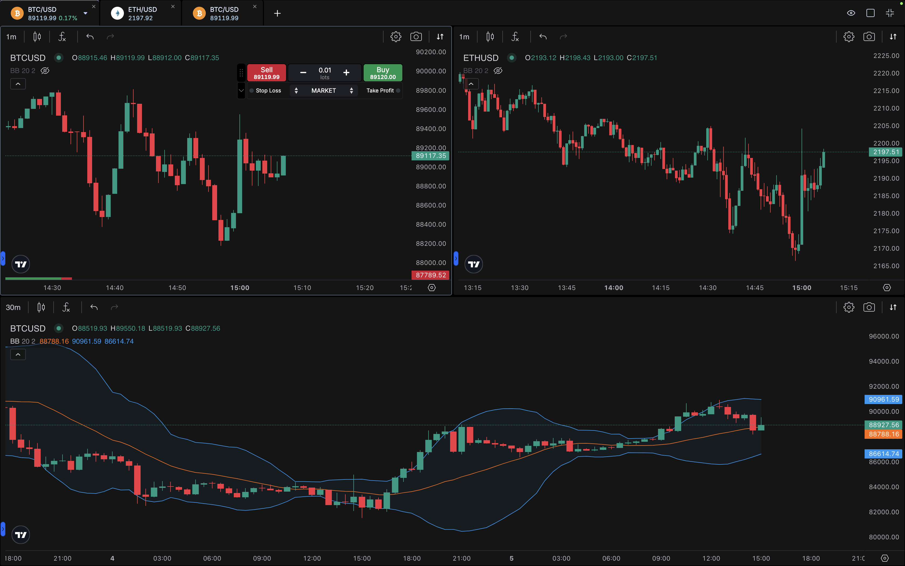

# Charts

## Advanced Charting Tools

- Access a wide range of chart types, including candlestick, line, and bar charts.
- Use technical indicators such as moving averages, Bollinger Bands, RSI, MACD, and more.
- Apply drawing tools like trend lines, Fibonacci retracements, and support/resistance levels to enhance your analysis.

## Chart Trading

- Place, modify, or close trades directly from the chart interface.
- View open positions and pending orders visually on the chart for precise trade management.
- Drag-and-drop functionality to adjust take profit (TP) and stop loss (SL) levels quickly.

## Multi-Charts

- Monitor multiple instruments simultaneously with multi-chart support.
- Customize chart layouts to track different timeframes or assets on the same screen.
- Ideal for traders managing diverse portfolios or executing multi-asset strategies.