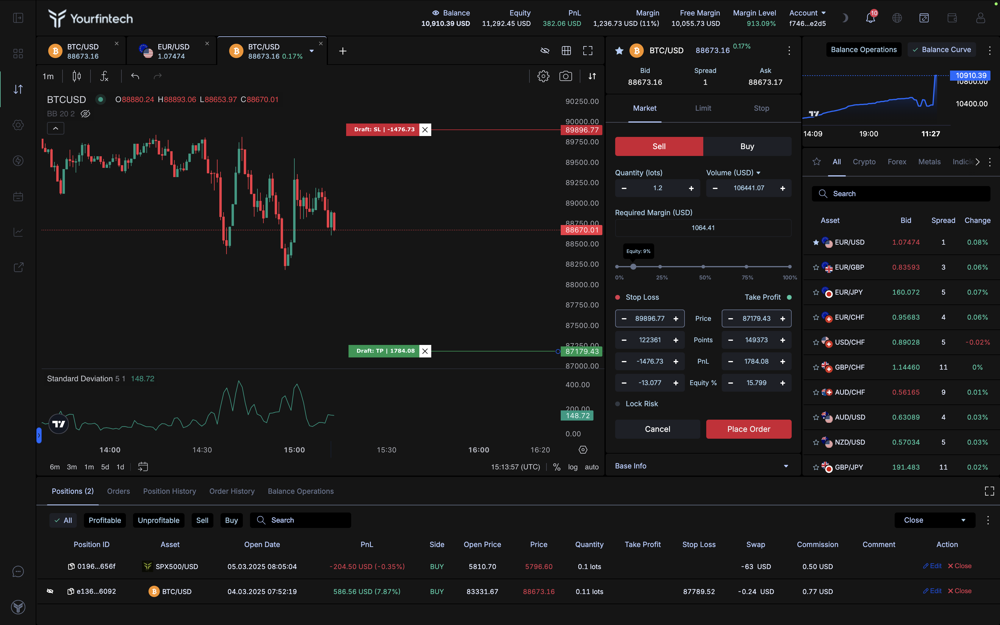

# Interface

## Key Features:

1. **Fully Resizable and Customizable Layout**:
      - Every widget can be resized, repositioned, or hidden to create a tailored workspace.
      - Layouts are container-based, enabling traders to drag and drop widgets between containers effortlessly.
2. **Widget Settings**:
      - Each widget comes with its own set of settings to enable or disable specific features.
      - Choose what data to display for better control over your trading environment.
3. **Multi-Screen Support**:
      - Use multiple screens for professional trading setups.
      - Example: One screen dedicated to charts, another for positions and orders.
4. **Workspace Builder**:
      - Create and save multiple workspace layouts to suit different trading strategies.
      - Assign workspaces to specific browser tabs or windows for better organization.
5. **Themes**:
      - Switch between light and dark modes for visual comfort.
      - Choose a theme that aligns with your trading preferences.
6. **Analytics Integration**:
      - Access real-time analytics directly from the interface.
      - Widgets like heatmaps, PnL trackers, and account metrics ensure you stay informed.

## Wallet

Manage your funds seamlessly with the **Wallet** feature:

- **Deposits & Withdrawals**: Easily fund your account or withdraw earnings.
- **Balance History**: View all transactions, similar to a banking or payment provider interface.
- **Internal Transfers**: Move funds between accounts with just a few clicks.

---

## Profile Section

Access your **Profile** to manage:

- **Personal Data**: Update your personal information.
- **Security Settings**: Enable two-factor authentication (2FA) and manage password changes.
- **KYC**: Complete identity verification for full account access and regulatory compliance.

---

## Charts

Our platform provides cutting-edge charting capabilities tailored for traders who demand precision and flexibility:

- **Advanced Charting Tools**: Access a wide array of chart types, technical indicators, and drawing tools to analyze market trends and make informed decisions.
- **Chart Trading**: Execute trades directly from charts with the ability to modify or close positions visually, simplifying trade management.
- **Multi-Charts**: Monitor multiple instruments simultaneously with customizable layouts, perfect for multi-asset trading strategies and comprehensive market analysis

---

## Performance Metrics

Track your trading performance with advanced metrics:

### Key Metrics

1. **Profitability**: Measure overall success across trades.
2. **Win/Loss Average**: Analyze your average gains versus losses.
3. **Win/Risk Ratio**: Evaluate how effectively you manage risk.
4. **Balance/Equity Trends**: Identify patterns in account health.
5. **PnL/Drawdown**: Monitor profitability and mitigate losses.

### How to Use Performance Metrics

- **Real-Time Monitoring**: Use during trading to track ongoing performance.
- **Post-Trade Analysis**: Review metrics to identify strengths and weaknesses in your strategy.
- **Strategic Adjustments**: Modify trading plans based on past performance data for continuous improvement.