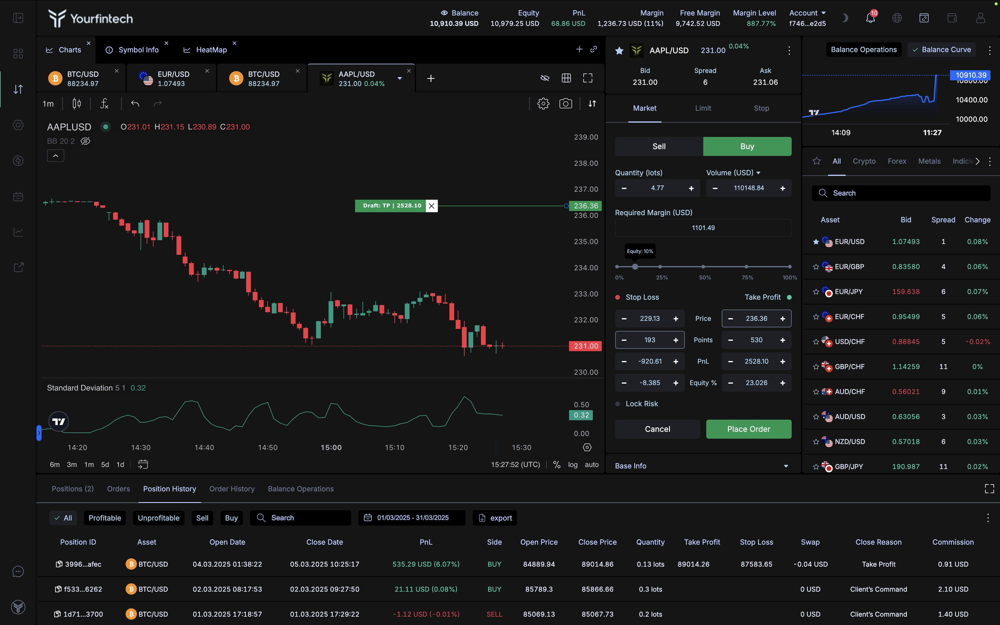

# Overview

## Web / Mobile Apps

Trading platform is accessible directly via the **web browser**, requiring no downloads or installations. This ensures quick and seamless access from any device, without the hassle of software setup. Additionally, we offer a **progressive web app (PWA)** version for mobile devices, enabling a fast, app-like experience that is lightweight and easy to install. Whether on desktop or mobile, the platform is optimized for professional and retail traders alike, providing the same powerful tools and functionality.

---

## Cross-Margin CFD Trading Platform

Our cross-margin CFD trading platform is designed for maximum flexibility, allowing traders to manage multiple instruments with optimized margin utilization. Cross-margin ensures that funds are shared across all positions, minimizing margin requirements for hedged or diversified portfolios.

### Key Features of Cross-Margin Trading

1. **Optimized Margin Usage**:
      - Funds in your account are pooled to support all open positions, reducing the risk of liquidation for individual trades.
      - Margin requirements are calculated based on the net exposure of all positions.
2. **Hedging Support**:
      - Open long and short positions simultaneously on the same instrument.
      - Manage risk effectively by leveraging hedging strategies to minimize exposure to market fluctuations.
3. **Wide Instrument Coverage**:
      - Trade CFDs across forex, indices, commodities, cryptocurrencies, stocks, and more.
4. **Real-Time Risk Management**:
      - Dynamic updates to margin level and equity ensure you have complete control over your portfolio’s health.

---

---