# Web Interface: UI/UX & Features

## Overview:

### The All-in-One Trading Ecosystem for Modern Traders

### Trade the Way You Think

Choose between hedging or netting modes depending on your strategy. Want multiple positions on the same asset? Prefer a clean, consolidated view? You decide.

Manage multiple accounts effortlessly, each with its own currency, leverage, and history - ideal if you’re running different systems or separating capital.

### Customize Everything

Design your perfect setup with workspaces and layouts that fit how you trade. Split screens, multi-monitor views, floating windows, tab-free containers - it's all possible. Whether you’re a minimalist or a multi-chart power user, your workspace reflects your workflow.

Use widgets to build a layout that does exactly what you need: charts, orders, positions, market watch, history, analytics - it’s all modular and moveable.

### Charts That Do More

Our integrated charting system (powered by TradingView) brings you advanced drawing tools, indicators, and direct trade placement - right from the chart.

Use the MultiChart view to monitor several assets or timeframes at once. Drag your stop loss and take profit lines visually. Resize charts, go fullscreen, and trade with precision in real time.

### Execution Without Friction

Place market, limit, or stop orders with ease. Use SL/TP and Lock Risk features to define your trade plan before you hit "Buy" or "Sell." Need to scale in, flip your bias, or take partial profits? It’s all built-in.

Trade from the chart, the trade form, or even directly from your watchlist - whichever is fastest for you.

### Stay Informed, Stay in Control

The platform keeps you constantly in tune with your performance. Use the Analytics Dashboard to spot trends in your PnL, win rate, and risk/reward. Dive into your Trading Journal for deep insights into your past decisions. See what’s working. Fix what’s not.

Your alerts and notifications let you know what’s happening - whether it's an executed order, a margin warning, or a new market event. You’re always in the loop.

### Go Beyond Execution

Use the Markets view to scan assets in real time, customize your data, and launch trades instantly. Tap into Market Insights like news, heatmaps, and economic calendars to see the bigger picture before you act.

### Report, Review, Repeat

Pull detailed statements and reports any time you need. Review trade history, PnL breakdowns, swap and commission costs - or just download a clean summary for your accountant or client.

### Built for Growth

If you’re building automated systems or connecting to other tools, the platform’s API access is ready to go. Build algos, plug into dashboards, or integrate with third-party services - with full control and secure authentication.

### Your Trading, Your Way

This isn’t just a trading platform. It’s your trading environment - one that grows with you, supports your decisions, and helps you trade better every day.

Whether you're here to test strategies, scale systems, or trade full-time - you're in the right place.

# Main Components & Features

## Trading Modes

### What is a Trading Mode?

Trading Mode defines how your positions are managed when you trade the same symbol multiple times. Your platform supports two primary trading modes:

### 1. Hedging Mode

Multiple positions per symbol

- Each trade you open (buy or sell) creates a separate position, even if it's on the same asset.
- You can hold simultaneous long and short positions on the same symbol.

Ideal for:

- Advanced strategies
- Short-term hedging
- Manual trade management

Example:

`You Buy 1 lot of BTC/USD → You have one long position
 You later Sell 1 lot of BTC/USD → Now you have both a long and a short position`

### 2. Netting Mode

One consolidated position per symbol

- All trades on the same symbol are merged into a single position.
- Opposing trades will offset or reduce your current exposure.
- Simpler to manage and use in many institutional environments.

Example:
`You Buy 1 lot of BTC/USD
 You then Sell 0.5 lot of BTC/USD → Your position is now +0.5 lot long
 You then Sell another 0.5 lot → Your position is now closed`

## Accounts & Metrics

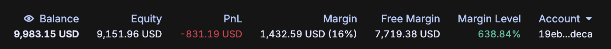

### Accounts Overview

Our platform allows you to manage multiple trading accounts, each with its own:

- Base Currency (e.g., USD, EUR, BTC)
- Trading Mode (Hedging or Netting)
- Leverage Settings
- Trading History and Statistics

Switch between accounts from the top-right dropdown menu. Each account is uniquely identified (e.g., 19eb...deca) for easy recognition.

→ Use different accounts for different strategies, assets, or risk levels.

### Real-Time Metrics Explained

Located at the top of the platform, your Account Metrics Panel gives you a quick snapshot of your financial status while trading.

Here's what each value means:

**Balance**

What it is:
Your account’s total funds excluding open trade profits or losses.
When it updates:
After a trade is closed or a deposit/withdrawal is made.

**Equity**

What it is:
Your real-time account value, including unrealized PnL from open trades.
Formula: Balance + Unrealized PnL
Helps you see your actual current worth.

**PnL (Profit & Loss)**

What it is:
Total unrealized profit or loss from all open positions.
Displayed live and color-coded (e.g., red = negative/loss, green = positive/profit).

**Margin**

What it is:
Total amount of capital being used to maintain open trades.
Shows both absolute value and percentage of your used Margin.

**Free Margin**

What it is:
Funds available to open new positions or to withstand losses.
Formula: Equity - Margin
Think of it as your safety cushion.

**Margin Level**

What it is:
A percentage showing how much margin you're using.
Formula: (Equity / Margin) × 100
Crucial for managing risk.
If this drops too low (e.g., <100%), you risk a margin call or auto-liquidation.

## Workspaces

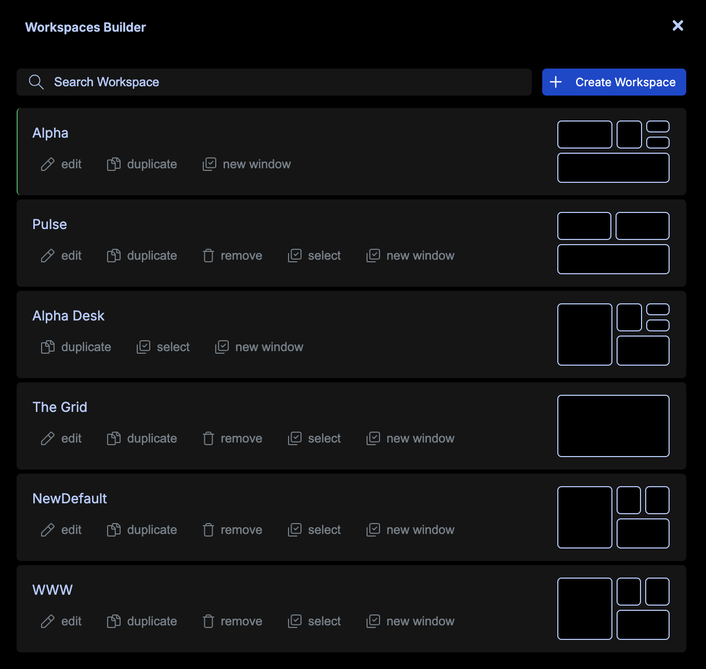

### What Are Workspaces?

Workspaces let you fully customize and save your trading environment - making it easier to organize charts, tools, and widgets based on how you trade.

→ Think of workspaces as your personalized “trading desk.”

### Why Use Workspaces?

- Switch between multiple strategies (e.g., scalping vs swing trading)
- Save chart layouts, indicators, and drawing tools
- Arrange tools and widgets for optimal workflow
- Avoid reconfiguring everything every time you log in
- Use different workspaces to optimize layouts across multiple monitors or trading setups.

### Switching Workspaces

1. Go to the Workspace dropdown
2. Select from a list of prebuilt workspace templates tailored for different trading styles
3. Or create your own custom layout from scratch using Workspace Builder

→ Create different workspaces for different asset classes or trading strategies.

## Workspace Builder

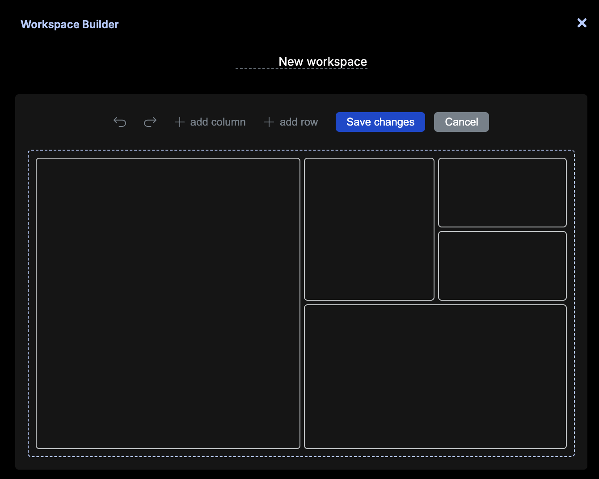

### What is the Workspace Builder?

The Workspace Builder is your personal layout manager, allowing you to design, customize, and save unique trading workspaces. Whether you're trading crypto, forex, or metals - build a layout that fits how you work.

### Overview of the Workspace Builder Interface

Main Features:

- Search Bar – Quickly find saved workspaces by name.
- Create Workspace Button – Launch a new layout design.
- Saved Workspaces List – View all of your saved workspaces with preview thumbnails.

Workspace Actions:

- edit – Modify the layout and widgets
- duplicate – Clone an existing workspace
- remove – Delete a workspace
- select – Load and activate the workspace
- new window – Open the layout in a new window

→  Open workspaces in separate browser windows to organize multiple layouts across different monitors for maximum efficiency.

### Creating & Editing a Workspace

Click Create Workspace to open the layout editor. You’ll see an empty grid structure where you can begin building your setup.

**Layout Tools:**

- Undo / Redo
- Add Column
- Add Row
- Save Changes or Cancel

### Managing Your Workspaces

Each workspace you save appears in the list with its layout thumbnail. You can:

- Select to apply it immediately
- Edit to change layout or content
- Open in a new window for multi-monitor trading
- Duplicate to use an existing setup as a base
- Remove when no longer needed

## Layouts

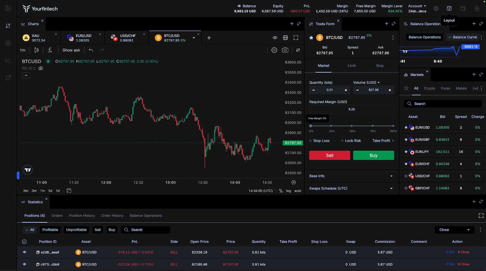

### What Are Layouts?

Layouts define how widgets and tools are visually arranged in your trading workspace. They give you full control over the structure of your platform - helping you optimize screen space, reduce clutter, and improve focus.

→  Layouts = your personalized grid for organizing tools, charts, and data in a way that fits your workflow.

### Core Structure

Every layout is built using:

- Containers - Sections of the screen that hold widgets (each container can hold tabs)
- Widgets - Tools like charts, order forms, trade history, balance info, etc.
- Tabs - Each widget inside a container is represented as a tab

### Key Layout Features

Layout Edit Mode

Located on the top bar

When activated, it enables Layout Editing Mode

- Add/remove widgets
- Rearrange tabs
- Reorganize layout structure
- Exit editing mode to lock your layout for trading

**Drag-and-Drop Functionality**

- Rearrange widgets between containers or into new windows
- Tabs can be reordered or detached as floating widgets
- Widgets update instantly - no reload required

**Containers with Tabs**

- Every container can hold multiple widgets as tabs
- Tabs can be reordered
- Keep important tools grouped together for quick access

### Smart Space Optimization

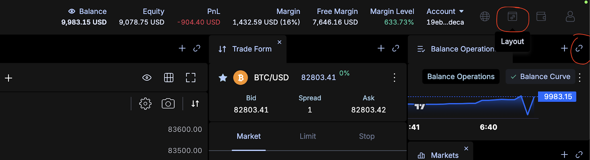

**Toggle Tab Visibility with "Freeze Tab" icon**

- Click the link icon in the top-right of a container to "freeze" tab visibility
- That container will continue to show tabs (for switching between widgets)
- Other containers will hide tabs, giving you more space to view content
- Helps maintain full control over your layout without overwhelming your screen

→ Use this to create a focused workspace:
One container shows multiple widgets with switchable tabs, while others remain clean and dedicated to a single tool.

**Hide Editing UI and Tabs Globally**

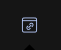

- You can hide the layout edit bar and widget tabs across the platform
- Great for maximizing screen space and reducing distractions while trading

## Widgets

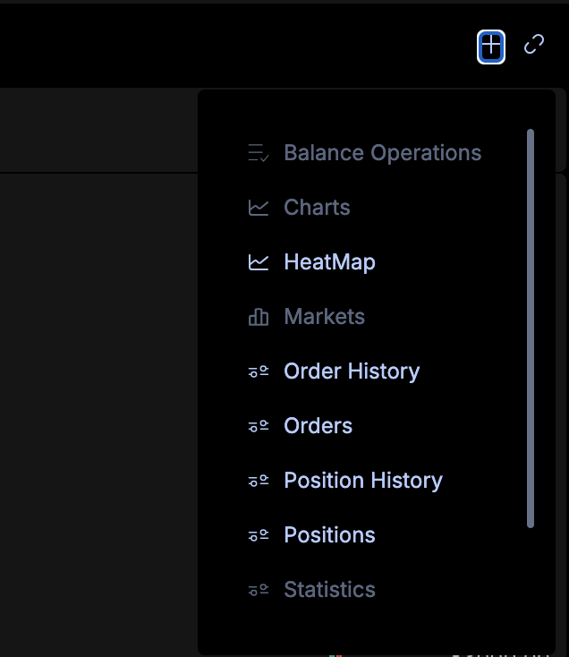

### What Are Widgets?

Widgets are the functional building blocks of your trading workspace. Each widget provides a specific tool, view, or control - such as a chart, order form, trade history, balance tracker, or market overview.

→ Use widgets to fully customize your workspace with the data and tools you need - when and where you need them.

**Widget Settings Menu**

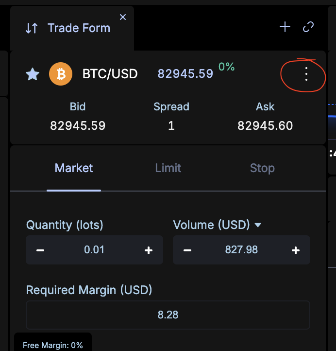

Every widget includes a three-dot menu icon in the top-right corner.
Click this to open widget-specific settings, such as:

- Change display options
- Customize content or filters
- Remove the widget from your layout

→ This allows every widget to behave independently - tailor each one to fit its specific use case.

### Adding New Widgets

To add widgets:

1. Click the + icon next to any tab
2. Choose from the widget menu that appears

Select one or more from the list:

- Charts
- Markets
- Order History / Position History / Positions / Orders
- Balance Operations
- HeatMap
- Statistics
- And more

1. The widget will appear in your current container as a new tab, ready to configure or use

## Analytics Dashboard

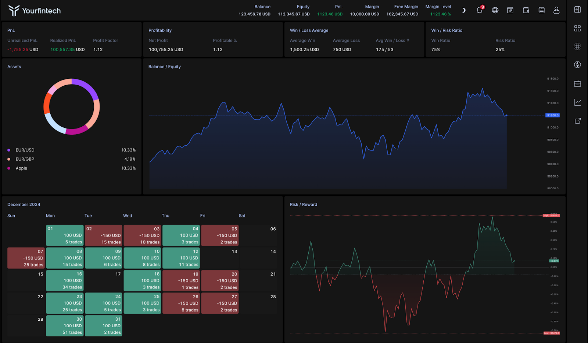

### What is the Analytics Dashboard?

The Analytics Dashboard is your all-in-one control panel for visualizing and evaluating your trading performance. It displays real-time and historical metrics that help you understand your profitability, trading habits, risk profile, and asset exposure.

→ Use it to refine strategies, spot patterns, and stay in control of your trading performance.

### Overview of Key Dashboard Sections

**PnL Summary**

Displays your profit and loss breakdown:

- Unrealized PnL – Open position profit/loss
- Realized PnL – Closed trades profit/loss
- Profit Factor – Total gains divided by total losses

**Profitability Panel**

- Net Profit – Total earnings after all losses
- Profitable % – Win rate percentage
- Profit Factor – Confirms if gains outweigh losses over time

**Win/Loss Average**

- Average Win vs. Average Loss – Compare trade outcome sizes
- Avg Win/Loss Count – Number of winning vs. losing trades

**Win / Risk Ratio**

- Win Ratio – % of trades closed in profit
- Risk Ratio – % of risk relative to equity or capital

### Performance Visuals

**Balance / Equity Chart**

- Plots equity and balance over time
- Useful for seeing growth trends and drawdowns

**Assets Pie Chart**

- Shows which assets you’ve traded and their weight in your portfolio
- Helps you understand exposure and diversification

**Trading Activity Calendar**

Daily summary view showing:

- PnL for each day (color-coded)
- Number of trades

Great for identifying:

- Consistently profitable days
- Overtrading tendencies
- Weekly patterns

**Risk / Reward Graph**

- Compares your actual return vs. the amount of risk taken
- Helps you visually track if your trades are producing more reward than risk

## Alerts & Notifications

### What Are Alerts & Notifications?

Alerts & Notifications are your platform's real-time messaging system - designed to keep you informed about everything from trade executions to platform announcements.

They are grouped into two distinct categories:

### 1. Alerts (Trading Events)

These are time-sensitive messages triggered by actions and risk-related events on your account. Examples include:

- Open Position - Confirms a new position has been successfully opened
- Close Position - Indicates a position was closed (manually or by TP/SL)
- Margin Call - Warning that your margin level has dropped too low
- Stop Out - Position(s) forcibly closed due to insufficient margin

→ Use Alerts to stay in sync with your trading account, even when away from the platform.

### 2. Notifications (Platform Messages)

These messages relate to general platform information or system-level updates:

- Promotions - Exclusive offers, bonuses, and special events
- Maintenance Notices - Upcoming system maintenance or downtime warnings
- Platform Updates - New features or release announcements

These keep you in the loop about what's happening behind the scenes.

### How It Works

All alerts and notifications appear as unread messages in your alert center

You can:

- Mark as read
- Delete
- Navigate between all alerts and notifications

### Navigation & Management

- Access the Alerts Center from the top bar (notification icon)
- Use tabs or filters to switch between Alerts and Notifications
- Messages are organized chronologically, with newest on top
- Clicking a message expands details like time, asset, and related action

## Watchlist & Favourites

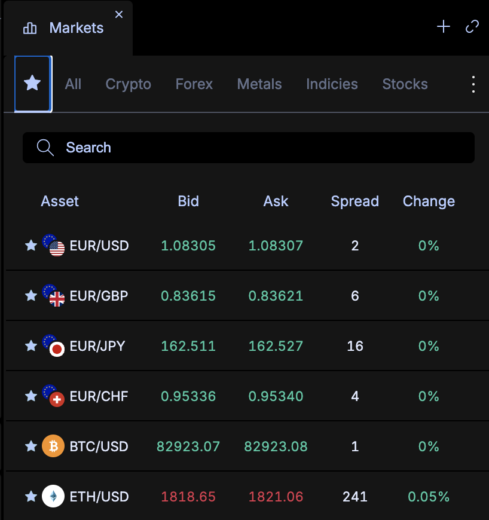

### What Is the Watchlist?

The Watchlist is your personalized list of favorite trading instruments - allowing you to track, monitor, and access them quickly for faster execution and decision-making.

Think of it as your trading shortcut hub - always focused on the symbols that matter most to you.

### How It Works

- The Watchlist = Your Favourites
- Instruments you've marked are automatically added to your watchlist

You can switch between:

- All Assets
- Crypto, Forex, Metals, Indices, Stocks
- Or filter by Favourites using the star tab

### How to Add or Remove Favourites

- Click the star icon next to any asset name
- Filled star icon = Added to Favourites
- Empty star icon = Not included

Assets can be added from any category tab, and they’ll instantly appear in your Favourites view.

### What’s Displayed?

Each asset row includes:

- Asset - Instrument name (e.g. EUR/USD, BTC/USD) with country/asset icon
- Bid - Best available price to sell
- Ask - Best available price to buy
- Spread - Difference between bid and ask (in points)
- Change - Price change percentage from previous session

## Trade Form (Extended View)

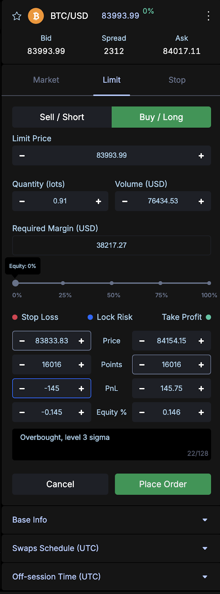

### What Is the Trade Form?

The Trade Form gives you full control over placing, configuring, and managing your trades. Whether you're executing a market order, setting a limit entry, or customizing Stop Loss and Take Profit levels, this form is built for precision.

→ Think of it as your trade command center - built for flexibility, speed, and risk control.

### Interface Overview (Extended)

**Header Info**

- Asset: Selected trading pair (e.g. BTC/USD)
- Live Price Feed: Bid, Ask, Spread, % Change
- Favorite Toggle: Add the asset to your Watchlist
- Three-dot Menu: Access widget-specific settings (e.g., refresh, remove)

### Order Type Tabs

Switch between:

- Market: Instant execution at current market price
- Limit: Set your entry price - trade executes only if price reaches it
- Stop: Trigger a market order once a condition is met

### Limit Order Form (as shown)

**Trade Direction**

- Buy / Long (Green): Enter expecting price to rise
- Sell / Short (Red): Enter expecting price to fall

**Key Trade Inputs**

- Limit Price - Price level where you want the order to trigger
- Quantity (lots) - Trade size in lots (e.g., 0.01)
- Volume (USD) - Value-based size, alternate to lot-based sizing
- Required Margin - Capital needed to open the trade
- Investment Range Bar - A visual gauge displaying the percentage of your Equity, Balance, or Free Margin available for trading.

### Risk Management Section

Configure:

- Stop Loss (SL): Exit if trade moves against you
- Take Profit (TP): Exit if trade hits your target
- Lock Risk: Define a fixed risk amount in your account currency for precise trade management.

Each risk field includes:

- Price level
- Distance in points or %
- Expected PnL from level
- Editable input fields with +/- toggles

→ Helps you plan risk-to-reward scenarios before placing the trade.

### Comment Field

- Add trade notes (max 128 characters)
- Useful for journaling trade rationale or tagging strategies

### Order Action Buttons

- Place Order (Green) – Confirm and send the trade
- Cancel (Dark Gray) – Discard input and close the form

### Expandable Info Panels

- Base Info – Additional asset or trade metadata
- Swaps Schedule (UTC) – View rollover/holding costs for this instrument
- Off-session time - Displays market session details and the current trading status of the selected asset.

## Trade Form Mini

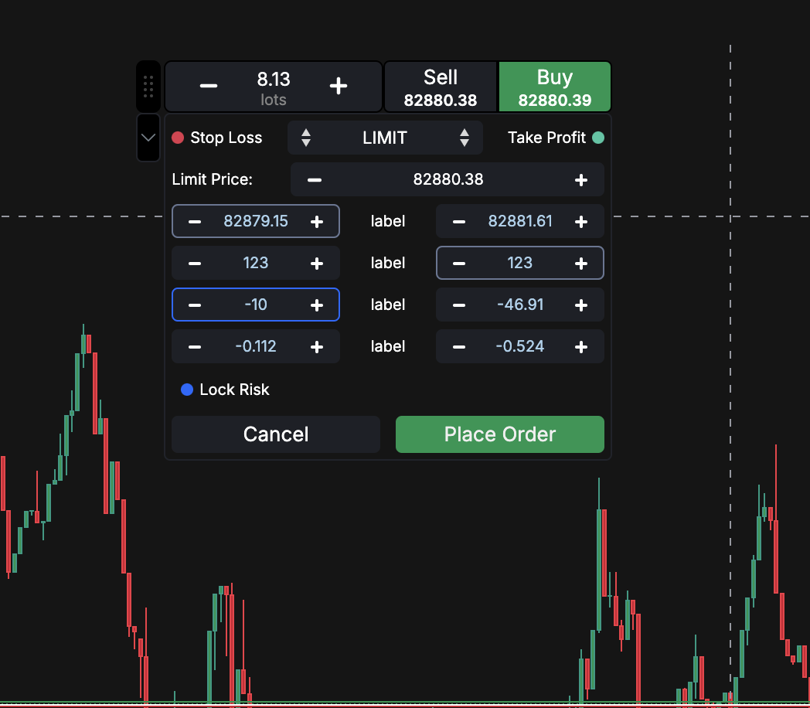

### What is the Trade Form Mini?

The Mini Trade Form is a compact, chart-embedded trading panel that allows you to place and manage trades directly from the chart, especially in full-screen mode. It offers quick access to key trade parameters without navigating away from your technical view.

→ Perfect for traders who want to act quickly while analyzing price action in real time.

### Key Features

**Chart-Integrated Panel**

- Appears directly on the chart (floating window)
- Optimized for fullscreen chart trading
- Can be dragged and repositioned freely

**Quick Buy/Sell Buttons**

- Instantly select Buy (green) or Sell (red) based on current price
- Displays live price feed per side of the trade

### Order Setup Controls

- Lot Size - Set quantity with +/- controls (e.g., 8.13 lots)
- Order Type Selector - Choose between Market, Limit, or Stop orders
- Limit/Stop Price Input - Define exact price level for limit entries
- SL/TP Configuration - Toggle and customize Stop Loss & Take Profit fields
- Lock Risk - Activate to fix risk in account currency

Each price input field includes multiple format options:

- Price level
- Distance (in points)
- Estimated PnL or risk

### Why Use the Mini Trade Form?

- Enables fast order placement while analyzing chart setups
- Reduces the need to switch tabs or open the full trade form
- Ideal for scalping, intraday setups, and reaction trades

### Action Buttons

- Place Order (green): Confirm and execute trade
- Cancel (gray): Close the form without action

## TP / SL & Lock Risk Feature

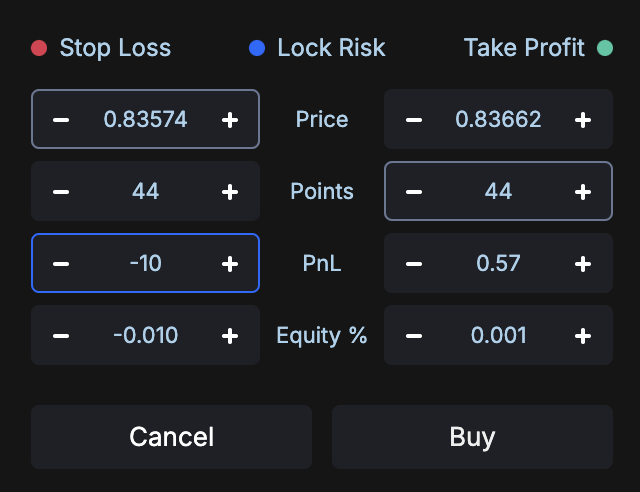

### What is TP/SL & Lock Risk?

The Take Profit (TP), Stop Loss (SL), and Lock Risk features are built to help you automate trade exits and manage risk precisely.

→ With just a few clicks, you can define exactly how much you're willing to risk and where you want to secure profits - no guesswork, no emotional exits.

**Stop Loss (SL)**

Automatically closes your position if the market moves against you

Configurable by:

- Price level
- Points (distance from entry)
- PnL (expected loss in currency)
- Equity % (portion of total capital to risk)

**Take Profit (TP)**

- Automatically closes your trade in profit once the target is hit
- Set using the same parameters:
- 
    - Target Price
    - Points
    - PnL (expected gain)
    - Equity %

**Lock Risk**

- Allows you to lock a specific risk amount in account currency
- The system auto-adjusts your SL based on the lot size, entry price, and locked risk
- Especially useful for traders using fixed risk-per-trade strategies

→ All fields are synchronized - updating one will recalculate the others in real time.

### Risk Management Metrics

- Price - Exact level for TP/SL
- Points - Distance from entry (great for scalpers or grid)
- PnL - Profit or loss in account currency
- Equity % - Portion of account capital involved in the trade

### Benefits

- Automate exits for smarter trading
- Remove emotional decision-making
- Protect capital with exact equity or currency-based stop levels
- Maintain consistent Risk:Reward ratios

### Tips

- Use Lock Risk to maintain consistent risk across trades, even with varying lot sizes
- Combine TP and SL to structure risk-to-reward ratios (e.g., 1:2)
- Use Equity % inputs for portfolio-style money management

## Order Types

### What Are Order Types?

Order Types define how and when your trade is executed. Your platform supports three primary order types: Market, Limit, and Stop, each suited for a different trading style or condition.

→ Choosing the right order type helps you control execution precision, price entry, and trading conditions.

### 1. Market Order

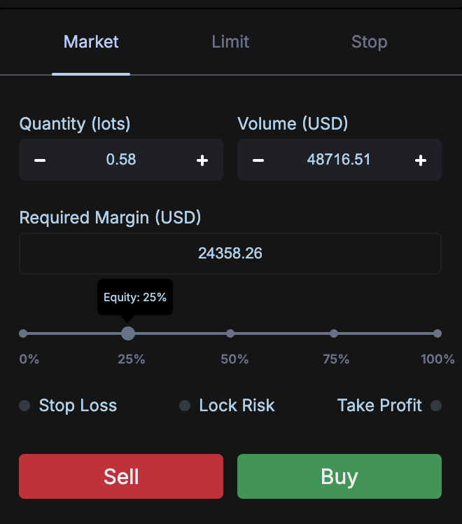

"Execute now at the best available price"

- Instantly buys or sells at the current market price
- Ideal for fast-moving or high-volatility situations
- No guarantee on price exactness, but ensures execution

Key Inputs:

- Quantity (lots) or Volume (USD)
- Optional: Add Stop Loss, Take Profit, Lock Risk
- Tap Buy or Sell to place the order immediately

→ Use when: You want fast execution more than exact price

### 2. Limit Order

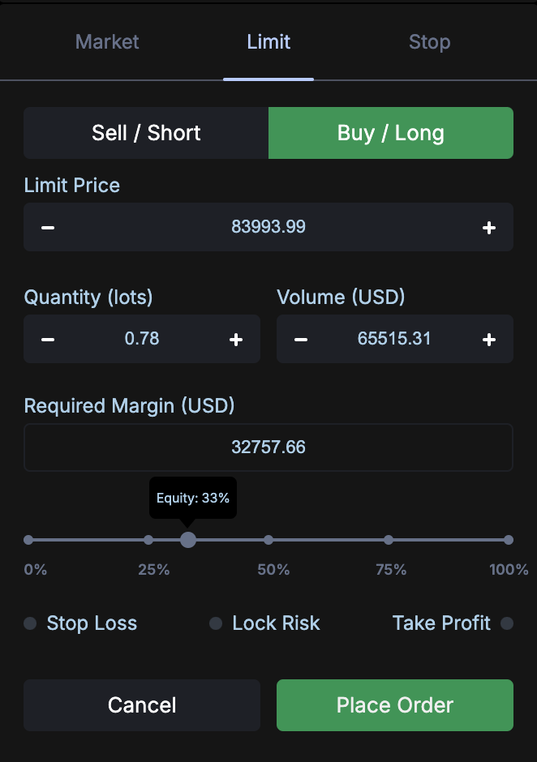

"Execute only at a specific price or better"

- Set a target entry price
- Buy Limit: Executes if price falls to your set level
- Sell Limit: Executes if price rises to your set level
- You control price, but execution only happens if price is reached

Key Inputs:

- Limit Price
- Quantity / Volume
- SL/TP and Lock Risk options
- Final action: Place Order (Buy/Long or Sell/Short)

→ Use when: You want to enter at key levels, like support or resistance

### Stop Order

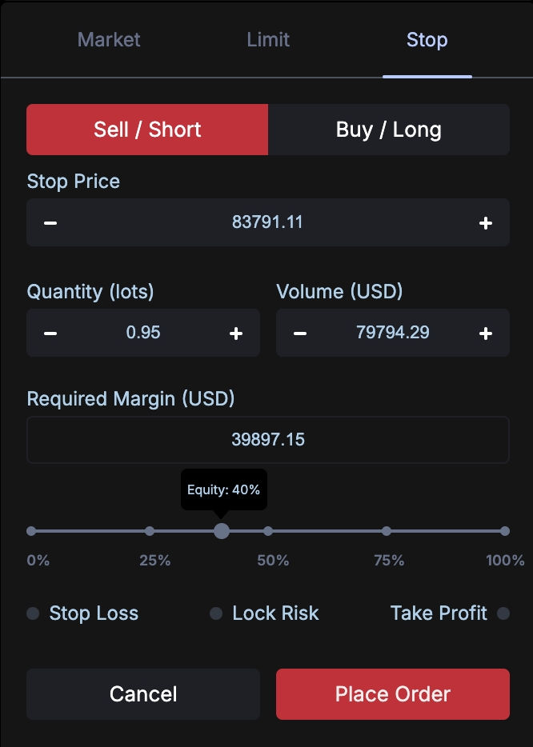

"Trigger a market order after a price threshold is hit"

- Becomes a market order once price crosses your Stop Price
- Buy Stop: Price must rise to trigger the buy
- Sell Stop: Price must fall to trigger the sell
- Commonly used for breakout trades or stop-entry setups

Key Inputs:

- Stop Price
- Quantity / Volume
- SL/TP and Lock Risk options
- Final action: Place Order

→ Use when: You want to enter on momentum or breakout confirmation

### Summary Table

|            |                  |               |                   |                             |
|------------|------------------|---------------|-------------------|-----------------------------|
| Order Type | Executes At      | Price Control | Execution Speed   | Use Case                    |
| Market     | Now (best price) | ❌ Low         | ✅ Instant         | Urgent entry, fast markets  |
| Limit      | Your set price   | ✅ High        | ❌ Conditional     | Reversals, pullbacks        |
| Stop       | After trigger    | ✅ Medium      | ✅ After condition | Breakouts, momentum entries |

### Tips

- Market = speed, Limit = precision, Stop = confirmation
- Combine any order with Stop Loss, Take Profit, and Lock Risk for safer execution
- Limit and Stop orders stay pending until triggered - you can edit or cancel them anytime

## MultiCharts

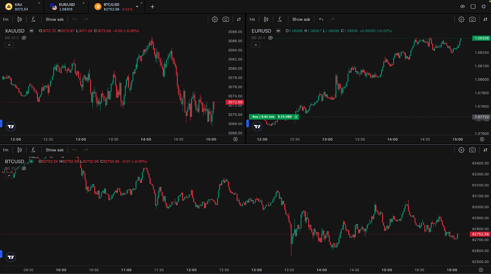

### What is MultiCharts?

MultiCharts lets you display and interact with multiple charts on a single screen. It’s built for traders who want to monitor several instruments, compare timeframes, or trade directly from charts - all without switching tabs.

→ Ideal for multi-asset monitoring, strategy testing, or top-down technical analysis.

### Key Features

- Multiple chart windows in one layout
- View different instruments, or the same symbol in multiple timeframes
- Add charts to custom containers within your workspace
- Resizable chart panels - drag borders to scale each view
- Real-time chart updates across all instruments
- Add independent indicators and drawings per chart
- Mini Trade Form support - place orders directly from any chart

### What You Can Do with MultiCharts

- Compare Instruments - Analyze EUR/USD, BTC/USD, and XAUUSD side-by-side
- Timeframe Comparison - Open BTC/USD on 1m and 15m to spot short- and long-term setups
- Trade from Chart - Use the embedded Mini Trade Form to quickly execute trades
- Workspace Specialization - Build indicator-heavy setups per asset or strategy
- Zoom, scroll, and sync freely - Customize view scale independently across all charts

### How to Use It

- Click the chart layout icon in the top-right of the chart widget to toggle:
- Single View – Focus on one chart full-screen
- MultiChart View – View multiple charts in a grid
- Use the + tab at the top to add new instruments to your chart widget
- For multi-timeframe analysis, open the same symbol in multiple tabs, then split your view
- Drag the borders between charts to resize each one based on your focus
- Apply indicators, chart types, and tools per chart independently

### Use Cases

- Asset Comparison - EUR/USD, BTC/USD, and XAU/USD side by side
- Timeframe Analysis - BTC/USD on 1m, 15m, and 1H views simultaneously
- Strategy Testing - One chart with Bollinger Bands, another with RSI or volume tools
- Focused Execution - Use one tab with MultiCharts for scalping, another for swing view

### Tips

- Resize charts by dragging panel borders for custom layouts
- Use the symbol tab bar to manage multiple instruments within the same widget
- Pair with Mini Trade Form for fast chart-based trading
- Combine with Workspaces to save entire multi-chart setups by strategy or asset class

## Advanced Charting

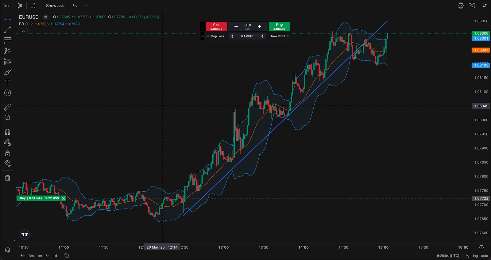

### What is Advanced Charting?

Advanced Charting delivers a professional-grade visual analysis experience powered by TradingView integration. With advanced tools for drawing, indicators, and in-chart trading, it's your complete technical workspace - all in one powerful chart module.

→ Analyze. Draw. Trade. All from your chart.

### Core Features

**Drawing Tools (Left Toolbar)**

- Trendlines, channels, Fibonacci, brush, shapes
- Text notes, icons, and risk/reward tools
- Lock, hide, and delete objects with one click
- Magnetic snap and layer options for cleaner charting

**Indicators & Strategies**

- Access a wide library of built-in indicators (e.g., Bollinger Bands, RSI, MACD)
- Customize parameters, styles, and overlays
- Add multiple indicators per chart

**In-Chart Trading Tools**

- Use the Mini Trade Form to place market, limit, or stop orders right on the chart
- Drag-and-drop Stop Loss or Take Profit lines directly for fast edits
- Visualize open trades, entry/exit, and PnL in real time

**Chart Layouts & MultiChart Support**

- Switch between single view and multi-chart grid
- Add multiple symbols as tabs and toggle easily
- View multiple timeframes or instruments side-by-side

### Additional Features

- Zoom, scroll, and crosshair tools
- Price and time scale customization
- Show/Hide Ask price, grid, and session breaks
- Save chart templates or use predefined layouts

### Tips

- Combine charting tools with the Mini Form for fast execution
- Use horizontal and trendline drawings as triggers for limit or stop orders
- Save your setups with Workspaces for different asset types or strategies
- Expand chart to fullscreen for distraction-free analysis and trade planning

## Trade From Chart

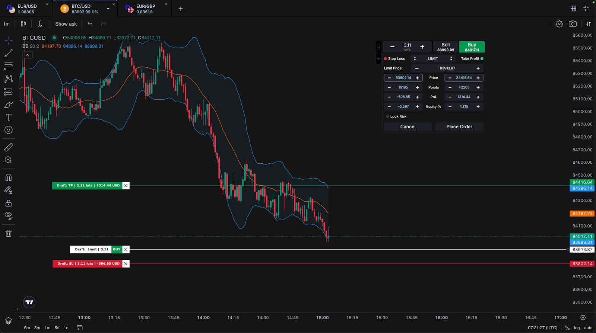

### What is Trade From Chart?

Trade From Chart allows you to place, adjust, and manage positions directly from the chart - using clickable, draggable order lines and visual feedback for absolute precision.

→  Click, drag, and trade without ever leaving your chart view.

### Key Features

- Place Market, Limit, and Stop Orders directly from the chart
- Draft lines show live SL/TP and Entry positioning before confirming the trade
- Stop Loss and Take Profit levels are fully draggable
- Auto-calculates updated price, distance, PnL, and equity % in real-time

Labels on lines show:

- Order type
- Lot size
- Expected PnL

### How to Trade from Chart

1. Open the Mini Trade Form or Full Trade Form (Market, Limit, or Stop)
2. Place your entry order - a line appears on the chart
3. Drag the red SL line to set a stop loss
4. Drag the green TP line to set a take profit
5. The price, distance in points, and risk/reward are automatically calculated
6. Click Save to confirm and send the order
7. Edit or cancel draft anytime before execution

### Visual Precision = Trading Confidence

- Quickly adjust trade levels with drag-and-drop interaction
- See your risk/reward before you commit
- Use zoom and grid levels for precise price targeting
- Instantly see updated PnL, distance in points, and equity risk as you move lines

### Manage Open Trades

Once a trade is open, you can still:

- Drag SL/TP lines to modify live positions
- Hover for detailed trade info
- Cancel or update orders from the chart

### Tips

- Use fullscreen mode for better visibility during chart-based trading
- Combine with Advanced Charting tools for technical-level execution
- Works seamlessly with Mini Trade Form and multi-chart layouts

## Statistics Widget

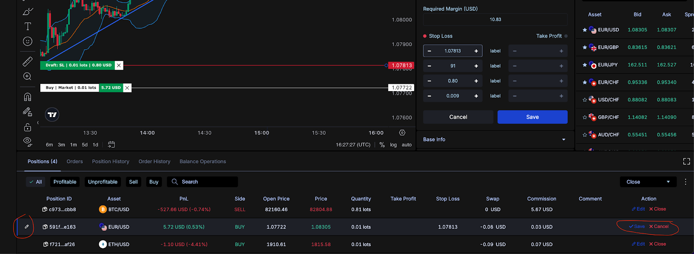

What is the Statistics Widget?

The Statistics Widget provides a powerful, table-based view of all your trading activity - from open positions and pending orders to full trading history. It combines real-time data, bulk actions, and deep customization for full trade control.

→ Think of it as your trading dashboard - fully actionable and visually connected to your charts.

### Core Features

**Column Customization**

- Use the column selector menu to show/hide data fields
- Choose what matters to you: PnL, Side, Symbol, Price, SL/TP, etc.
- Tailor your table layout to your workflow or strategy style

Perfect for:

- Scalpers who focus on price and size
- Swing traders needing SL/TP fields
- Journalers tracking commissions and comments

**Bulk Close Functionality**

Access the Close dropdown menu for mass position management:

- Close All - Exit all open trades instantly
- Close Profitable - Secure gains across all green trades
- Close Unprofitable - Cut losses with a single click
- Close All Buy - Exit all long positions
- Close All Sell - Exit all shorts in bulk

Ideal for fast action in volatile markets, profit securing, or loss control.

### Key Tools

- Checkbox Select - Select individual positions for custom action
- Show/Hide Position on Chart- Toggle visibility of positions on the chart
- Editable Positions - Double-click or click edit to edit live positions
- Inline Save/Cancel - After editing, use Save or Cancel directly in the row
- Live Updates - Data updates in real-time, synced with the chart
- Filters - Instantly filter by Buy, Sell, Profitable, Unprofitable

### Tabs Overview

- Positions – Active trades with full control
- Orders – Pending market, limit, and stop entries
- Position History – Closed trades with outcome data
- Order History – Executed and canceled order logs
- Balance Operations – Deposits, withdrawals, adjustments

### Tips

- Use filters selection to create your trading table view
- Combine bulk close with filters (e.g. close all profitable Buys only)
- Keep chart uncluttered by hiding unnecessary positions
- Use Position History tab for journaling or export data

## Double Up, Reverse Position & Partial Close

### What Are These Actions?

These advanced tools give you more flexibility in managing open positions without needing to open new trades manually. They're ideal for active traders who want fast reaction tools during volatile moves or strategy shifts.

→ Think of these as “power tools” for live trade management - double down, flip your bias, or scale out.

### Double Up

Instantly double your current position size at the current market price.

- If you're long 1.00 lot EUR/USD, Double Up will instantly open an additional 1.00 lot long at market.
- Works for both Buy and Sell positions
- New position is opened separately, added to your existing exposure
- Margin requirements are recalculated based on the increased total size

Use when:

- You're confident in momentum continuing
- You want to increase exposure mid-move
- You're scaling into a breakout or trend

### Reverse Position

Automatically closes your current position and opens a new position in the opposite direction with the same size.

- If you’re long 0.50 lots, Reverse will close that and open 0.50 lots short
- Executed instantly at market price
- Efficient for reacting quickly to market reversals or news

Use when:

- Your analysis flips and you need to change bias fast
- A support/resistance break invalidates your setup
- You want to avoid manual closing + new order delays

### Partial Close

Close a portion of your current position, keeping the rest open.

- Available in the position action panel
- Enter the exact lot size or percentage to close
- Remaining portion stays live
- PnL is booked for the closed portion only

Use when:

- You want to secure profits but still ride the trend
- You're scaling out as price nears a key level
- You're reducing risk while keeping upside potential

### Tips

- Use Partial Close + Trailing Stop for dynamic position management
- Combine Double Up with locked SL to maintain fixed risk
- When using Reverse, always reassess your margin availability

## Markets & Pricing

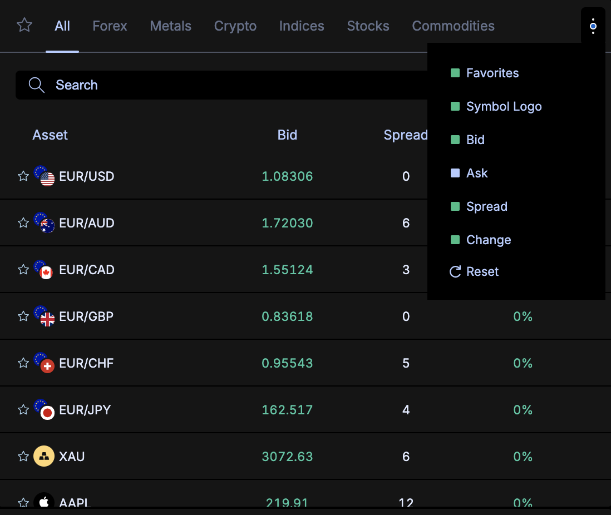

### What Is Markets widget?

The Markets widget is your real-time view into all tradable instruments on the platform. It shows live quotes, spreads, and key price data - fully customizable to fit your trading style.

→ It’s your launchpad for executing trades, watching movements, and scanning opportunities across all markets.

### Key Features

### Instrument List with Live Quotes

View all available assets including:

- Forex, Crypto, Metals, Indices, Stocks, Commodities

Each row displays:

- Asset name & symbol
- Bid / Ask price
- Spread
- Price Change (%)
- Favorite toggle

**Customizable Columns**

Use the 3-dot menu (top-right) to control which data is visible:

- Favorites
- Symbol Logo
- Bid / Ask
- Spread
- Change (%)
- Reset to default layout anytime

### Instrument Search & Filtering

- Search bar to quickly find any instrument by symbol or name
- Category tabs to filter by market type (Forex, Crypto, etc.)
- Favorites tab to keep your most-traded instruments in one place

### Use Cases

- Scan for volatility - Watch Spread or Change %
- Find best entries - Monitor Bid/Ask movement
- Build a watchlist - Mark Favorites
- Reduce clutter - Hide unused columns via settings

### Tips

- Use the Favorites tab for quick access to your core trading pairs
- Sort by Spread to find low-cost entries
- Sort by Change % to identify trending or volatile assets
- You can open a chart or trade form by clicking directly on any asset

## Market Insights & Tools

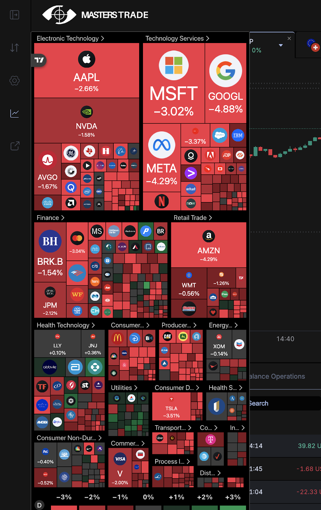

### What Are Market Insights & Tools?

Market Insights & Tools offers a suite of data-driven widgets that help you analyze market sentiment, track breaking events, and anticipate market-moving news - all in one place.

→ Designed for smarter decision-making, not just data watching.

### Key Components (as shown in the image & platform)

**Heatmap (Market Visualizer)**

- A dynamic visual tool that shows real-time performance of assets across sectors

Sectors include:

- Electronic Technology, Finance, Retail, Energy, etc.

Color-coded by price change:

- Green = gainers
- Red = losers
- Size = Market Cap: Larger blocks = bigger companies
- Hover to see change %, click to open the asset

Use it to:

- Spot sector rotation
- Identify outperformers or laggards
- Scan for volatility opportunities

**News Feed**

- Get real-time market headlines directly inside your trading workspace
- Coverage includes economic events, company earnings, geopolitical alerts
- Filter by asset class or relevance
- Some platforms support integrated sentiment signals (bullish/bearish tone)

Use it to:

- React quickly to news-driven price moves
- Stay informed without switching platforms

**Economic Calendar**

- Displays upcoming macroeconomic events (e.g. NFP, CPI, Rate Decisions)
- Includes:
- 
    - Country
    - Event name
    - Forecast vs. Previous vs. Actual
    - Volatility impact indicator (low / medium / high)
- Timezone auto-syncs to your system or platform settings

Use it to:

- Prepare for high-impact news
- Avoid overexposure during volatile events
- Align trades with monetary policy cycles

### Tips

- Use the heatmap for quick scanning and watchlist building
- Check the economic calendar daily before opening trades
- Pair news feed with active positions for faster reaction time
- Watch for sector-wide shifts (e.g., tech red while energy green)

## Trading Journal

### What Is the Trading Journal?

The Trading Journal is your personal performance dashboard - automatically tracking trade data, outcomes, and key statistics to help you analyze your trading behavior, identify patterns, and make smarter decisions.

→ Great traders don’t just trade - they review, refine, and improve.

### What It Tracks

Your journal automatically logs every trade and breaks it down into actionable insights, including:

- Trade Details - Asset, direction (Buy/Sell), entry/exit, date, size
- PnL & % Return - Realized and unrealized profits/losses
- SL/TP & Risk Setup - Whether you used stop loss, take profit, or lock risk
- Holding Time - How long trades stay open on average
- Trade Comments - Personal notes or strategy comments

### How to Use It Effectively

1. Review your performance weekly or monthly
2. Look for:
3. 
      - Overtrading?
      - Better results on certain instruments or timeframes?
      - Inconsistent use of SL/TP?
4. Use tags or comments (if available) to label strategies
5. Focus on consistency over single trade outcomes

## Trading API & Algos

What Is Trading API & Algos?

The Trading API & Algos feature allows you to automate your trading, build custom strategies, and integrate external systems or third-party platforms. It’s ideal for algorithmic traders, developers, and institutions looking for full programmatic control over their trading operations.

→ Automate strategies, connect systems, and trade smarter - 24/7.

### Key Capabilities

- REST API / WebSocket - Access market data and manage orders in real time
- Order Management - Place, modify, cancel orders via code
- Position Tracking - Monitor open positions, balances, margin, and equity
- Market Data Feeds - Stream live Bid/Ask, OHLC, spreads, and more
- Custom Algo Execution - Build trading bots or strategy engines
- Third-Party Integrations - Connect with platforms like TradingView, MetaTrader, Excel, or proprietary systems

### Use Cases

- Algo Trading Bots – Execute pre-set strategies without manual input
- Arbitrage Engines – Spot and act on price differences across instruments
- Backtesting Systems – Simulate strategy performance with historical data
- Dashboard Integration – Sync your data into analytics tools (Python, Excel, etc.)
- Risk Automation – Auto-close or hedge based on custom portfolio risk logic

### Authentication & Security

- Secure API keys with user-controlled permissions
- Rate limits and throttling to protect platform performance
- Optional IP whitelisting and 2FA integration
- Access logging for monitoring API usage

Documentation & Support

- Full API docs available via the developer portal
- Includes sample requests, libraries, and error handling guides
- Sandbox/testing environment (if supported)
- Dedicated developer support for integration questions or troubleshooting

### Tips

- Use WebSockets for real-time updates without polling
- Build modular scripts that separate signal generation from execution logic
- Always validate response data before triggering high-value trades
- Use logging and alerts to monitor automated performance in real time

## Advanced Reporting & Statements

### What Are Advanced Reporting & Statements?

Advanced Reporting & Statements give you comprehensive access to your trading, performance, and account history - with the ability to generate, export, and analyze detailed reports over time.

→ Stay compliant, track performance, and make informed decisions - all from one place.

### What You Can Access

- Trading Activity - Complete list of trades with timestamps, asset, direction, size, price, SL/TP
- Account Statements - Balance, equity, margin, free margin, and margin level over time
- PnL Breakdown - Realized vs Unrealized PnL by day, week, month, or custom period
- Deposits & Withdrawals - Full cashflow audit trail with timestamps and amounts
- Swap & Commission Summary - Aggregated swap fees, commissions paid, and other trading costs
- Performance Metrics - Win rate, average return, profit factor, risk-to-reward, etc.

### Key Features

- Custom Date Range Selection – Filter reports by exact date or preset timeframes
- Export to CSV / PDF – Download statements for tax, audit, or offline analysis
- Recurring Statement Generation – Weekly/monthly summaries automatically generated
- Drilldown Reports – Click into trades to view individual order histories and SL/TP logic
- Chart Visualizations – Equity curves, profit distribution, and risk metrics over time
- Email Delivery – Option to receive reports via email

### Use Cases

- Track Strategy Performance – Measure how a specific system performs over time
- Tax & Compliance Reporting – Generate accurate reports for filing or audits
- Performance Review – Spot patterns in wins/losses, holding time, or costs
- Institutional Monitoring – Segment reporting by strategy, sub-account, or trader

### Tips

- Compare realized vs. unrealized PnL to evaluate exit strategy effectiveness
- Use cost summaries (swap, commission) to optimize lot sizing and hold time
- Leverage performance ratios (like profit factor or Sharpe) to refine systems
- Schedule monthly PDF exports to keep a clean, consistent audit trail

## Settings Widget

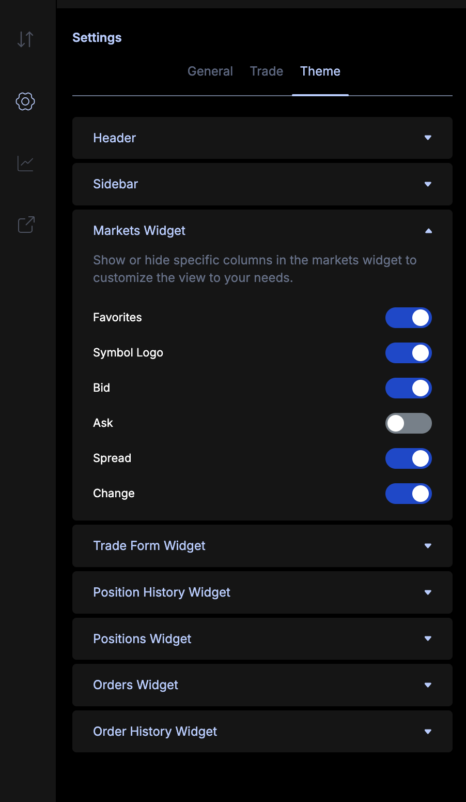

The Settings Widget is your central hub for customizing how the platform looks, feels, and functions - all in one place. From layout preferences to widget-level display options, it puts you in full control of your environment.

### Why It Matters

No more digging through menus or changing preferences screen by screen. This widget consolidates all your visual and functional settings in one intuitive panel - so you can fine-tune your workspace without interrupting your flow.

### Customize by Section

Organized into clear tabs like General, Trade, and Theme, the Settings Widget lets you adjust everything from how prices display, to which columns show in each widget.

- Markets Widget
  Show or hide columns like Bid, Ask, Spread, or % Change to simplify your market view.
- Trade Form, Orders, Positions & History Widgets
  Toggle display elements, streamline your inputs, or enable detailed fields - per widget, per your style.
- Header & Sidebar
  Control interface visibility and personalize the look and feel of your platform layout.

Themes & Display

Switch between visual styles or adjust element visibility to match your workflow - whether you want a clean, minimal view or a data-rich dashboard.

### Live Preview & Instant Changes

Any change made through the Settings Widget is reflected live - no reloading, no saving needed. Tweak on the fly as you trade.

### One Place. Total Control.

From display settings to interface preferences, the Settings Widget makes your workspace truly yours - clean, efficient, and always tailored to how you trade.

## AI Virtual Coach

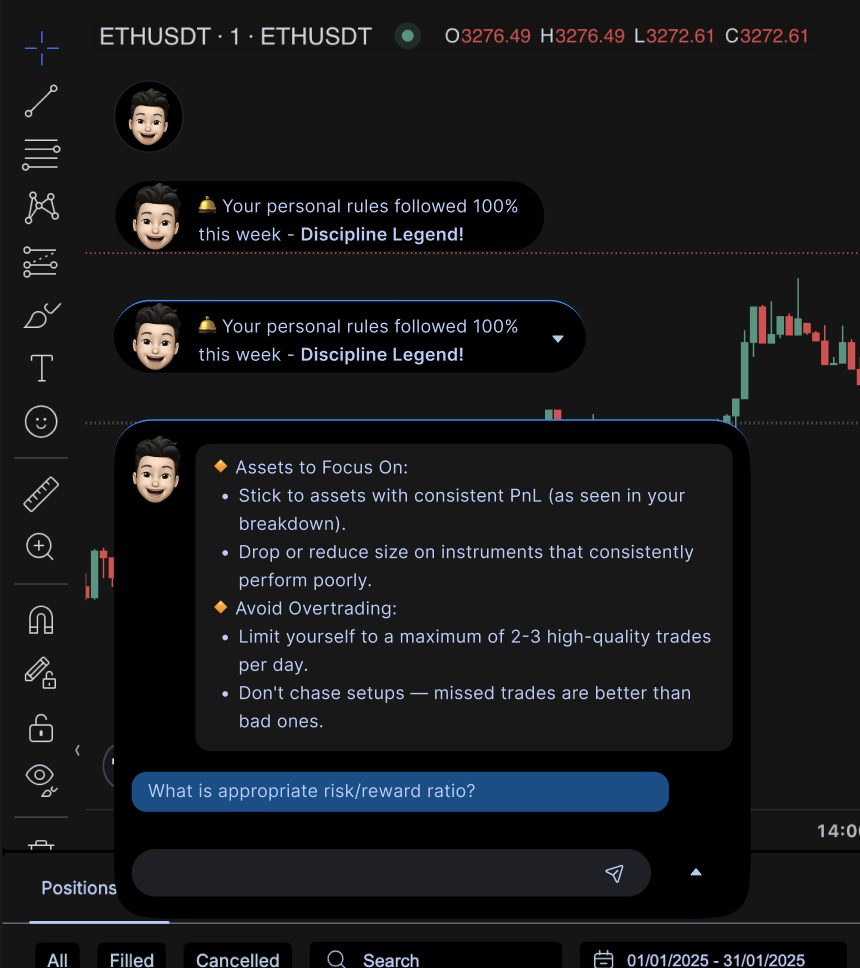

The AI Virtual Coach is your personal trading assistant - built to guide, motivate, and keep you aligned with your strategy. Whether you’re celebrating a win, slipping into overtrading, or crushing a streak, your Coach is always one step ahead, offering actionable feedback and real-time accountability.

### How It Works

This isn’t just a chatbot - it’s a data-driven mentor. The Coach actively analyzes your trades, habits, and performance in the background, then delivers short, focused messages designed to support smarter trading decisions.

### When It Appears

- Idle Mode: The Coach sits quietly on your sidebar until triggered
- Post-Trade: Get instant feedback after closing a trade
- End-of-Day/Week: View recap badges, risk metrics, or discipline scores
- On Hover: Preview key insights without interrupting your chart view
- On Click: Expand to full conversation view with chat-style coaching

### Coaching On Demand

Open the full chat view to ask your own questions like:

“What’s a good risk/reward ratio for my strategy?”
“How many trades did I force this week?”
“How often do I hit my stop?”

The Coach responds with tailored prompts based on your actual data - turning self-review into an interactive experience.